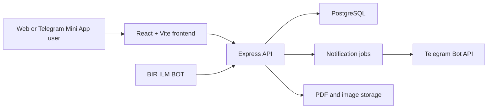

# BIR ILM System Architecture

## Architecture

## Components

- `apps/web`: public website, Telegram Mini App, quiz participant UI, admin dashboard shell.
- `apps/api`: authentication, catalog, quiz, analytics, notification, and Telegram webhook API.
- `database/schema.sql`: normalized PostgreSQL schema for users, RBAC, books, reviews, quizzes, attempts, achievements, notifications, and events.
- `packages/shared`: shared domain types used by frontend and backend.

## Production Boundaries

- Frontend deploys to Vercel.
- Backend deploys to Railway or Render.
- PostgreSQL is a managed cloud database with daily backups.
- File assets and PDFs should live in object storage, with signed URLs for protected downloads.
- Telegram Bot API receives webhook events at `/api/telegram/webhook`.
