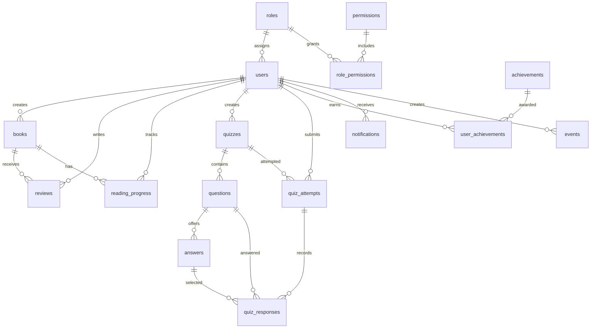

# Database ERD

```mermaid
erDiagram
  roles ||--o{ users : assigns
  roles ||--o{ role_permissions : grants
  permissions ||--o{ role_permissions : includes
  users ||--o{ books : creates
  users ||--o{ reviews : writes
  books ||--o{ reviews : receives
  users ||--o{ reading_progress : tracks
  books ||--o{ reading_progress : has
  users ||--o{ quizzes : creates
  quizzes ||--o{ questions : contains
  questions ||--o{ answers : offers
  quizzes ||--o{ quiz_attempts : attempted
  users ||--o{ quiz_attempts : submits
  quiz_attempts ||--o{ quiz_responses : records
  questions ||--o{ quiz_responses : answered
  answers ||--o{ quiz_responses : selected
  users ||--o{ user_achievements : earns
  achievements ||--o{ user_achievements : awarded
  users ||--o{ notifications : receives
  users ||--o{ events : creates
```
